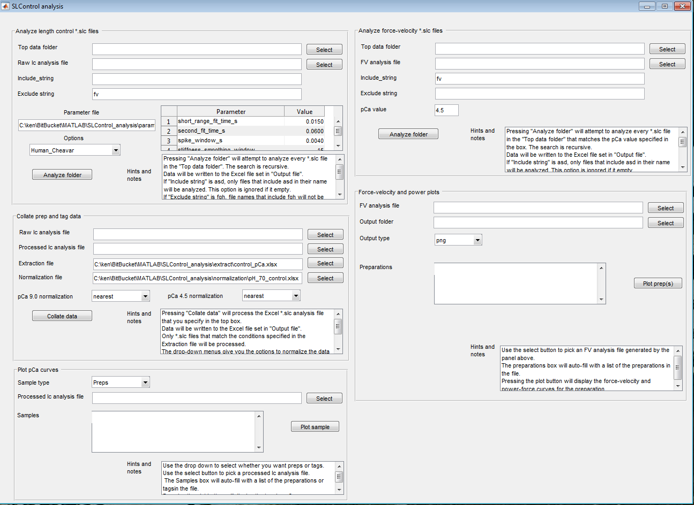

# Length control

## Overview

This page describes how to analyze length control experiments (the sort where you include stretches and/or ktr measurements)

Here's the big picture:
+ Analyze all of your data to create a single Excel file that contains many parameters (for example, force, stiffness, ktr) for every SLControl record you collected.
  + We call that file the `raw_lc_analysis_file`
+ Parse the `raw_lc_analysis_file` to extract data for certain conditions (e.g. records at a certain pH).
+ When you extract this data, keep track of which files contain data from each preparation and use that information to calculate things like relative tension and pCa50 that require comparing data from multiple files.
  + The file containing the extracted data is the `processed_lc_analysis_file`

## Strong recommendation

Run your analysis *incrementally* until you get the hang of it because it is relatively easy to trouble an analysis that only includes a few files, and quite challenging to troubleshoot a large project.

To run incrementally:
+ Test your analysis for each preparation by itself
  + Create a test folder structure that only contains data from one preparation
  + Analyze that folder to create a `raw_lc_analysis_file`
  + Run your extracts on that folder and create a `processed_lc_analysis_file`.
  + Make sure you understand the output and that it makes experimental sense
  + If you encounter problems, a common source of error is incorrect metadata in the SLControl files. Check that first.
+ Then repeat the process replacing the data in your test folder with data from the next preparation.
+ Keep going until you are confident that each preparation produces satisfactory output.
+ Finally, run your analysis starting with the top level data folder.

## Workflow

+ [Organize](../organization/organization.html) your data
+ Update your repositories. You need the latest versions of
  + [SLControl analysis](http://github.com/Campbell-Muscle-Lab/SLControl_analysis)
  + [SLControl utilities](http://github.com/Campbell-Muscle-Lab/SLControl_utilities)
  + [MATLAB utilities](http://github.com/Campbell-Muscle-Lab/SLControl_utilities)
+ Make sure all of these repositories are on your MATLAB path
+ Start MATLAB
  + Change the working directory to `<SLControl_analysis_repo>/code/analysis_gui.m`
  + Press `F5` to get this window

+ Start with the top left panel *Analyse length control *.slc files*
  + Set the `top data folder` (the folder that contains all the files and folders you want to analyze - though remember the *Strong recommendation* above as you are getting started)
  + Set the `analysis file` (where you want to store the `raw_lc_analysis_file`)
  + Use `include_string` and `exclude_string` to confine your search to certain files in the directory
    + you may not have to use these options, in which case leave them as is
  + Press     
