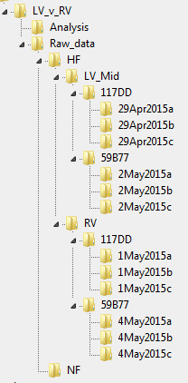

# Organization

The software is based on the assumption that you have a 2-factor design.

For example, you may be testing how force-pCa curves vary in myocardium from the left and right ventricles in patients who do or do not have heart failure. In this case:
+ `factor 1` is *ventricle* and can take the values of
  + *left*
  + *right*
+ `factor_2` is *heart_failure_status* and can take the values of
  + *heart_failure*
  + *non_failing*

If you are only testing one factor in your experiment, keep reading but pay special attention to the very last section where single factor designs are addressed.

It is also likely that you will have data from multiple preparations from several different people or animals. For example, you might have 2, 3, or 4 cells from each of 12 people. The source of the cells - that is whether they came from John Doe or Jane Doe - is important because it can be used as a grouping variable to increase statistical power.

We call the source of the cells the `tag`. If you are working with tissue from our biobank, the `tag` is the patients's hashcode (for example, 117DD). If you are working with data from animals, you could use an identity number for the mouse or simply write something like Mouse_1.

The last organizational level is the preparation itself - the specific cell or trabecula that you were analyzing. In most cases, you will have recorded multiple SLControl files from a single preparation. All of the files, and nothing else, should go in a single folder that has a unique name. The name of the folder identifies the `prep`.

The recomended approach is to name the folder with the data followed by 'a', 'b', 'c', etc. to indicate whether it is the first, second, or third prep you analyzed from the `tag` on that day. For example, 29May2020a, 29May2020b, 29May2020c.

Putting all this together, you should organize your SLControl files in a folder structure of the form

`<project>/raw_data/factor_1/factor_2/tag/prep`

## Tip

+ Avoid using spaces in folder and file names.
  + For example, use `Heart_failure` as opposed to `Heart failure`

## Example

Here is an example layout

## Explanation

Here's the explanation.
+ Everything do with this mechanics experiments is in the project folder called LV_v_RV
+ All of the SLControl data is in a single folder called Raw_data. Nothing else ever goes in that folder.
+ Raw_data is divided into 2 folders, HF and NF. These are the groups that form Factor 1.
+ The HF folder contains 2 folders, LV_Mid and RV. These are the groups that form Factor 2.
+ The LV_Mid folder contains two folders, 117DD and 59B77. These are two tags.
+ The RV folder contains the same two folders, 117DD and 59B77, because we are analyzing samples from different regions of the same heart.
+ Each tag folder contains 3 prep folders.

In summary, we analyzed 12 preparations from the LV or the RV of 2 separate people.

## Single factor experiments

If you don't have 2 factors, you can fake a top-level factor by nesting all of your data inside a single folder that can take any name.

In the example below, `factor 2` (knock_out or wild_type) is inside a single folder called Dummy. This is the sole group in `factor 1`.

